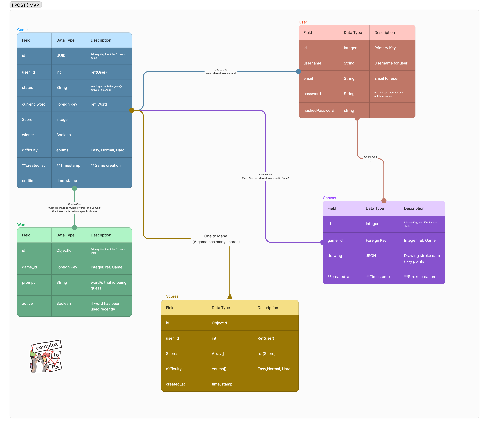

# **_Whataduudle_**

## Project Created By

- Mandy DeCamp
- Norman Lee
- Tim Lim
- Emmanuel Rosario
- NyuntSein

## **Technologies**

### **_FRONT-END_**

- Tailwind - CSS
- React
- Tensor Flow
- CanvasAPI
- Javascript
- Vite

### **_BACK-END_**

- Python
- Django
- POSTGRESQL
- Django REST Framework
- CORS
- rest_API

## What is **_WhatADuudle_**?

**_WhatADuudle_** is a drawing game where players can have an quick, exciting and fun time, testing their drawing skills.

**HOW TO PLAY**

1. Press the **_'Play'_** button and recieve a word.
2. Once you are ready, click **_'Start Drawing'_** and begin to draw within the time-limit.
3. Once timer is up, the computer will guess and if it guesses the drawing to the word provided, **YOU WIN!**
   Else You lose and you can try again
4. **\_**Repeat and HAVE FUN!!**\_**

## USER STORIES

1. As a User (AAU), I want to be able to sign up for an account if I choose to.
2. AAU, I want to be able to sign in and sign out.
3. AAU, I want to be able to see a landing page.
4. AAU, when the game is won or lost, I want to be able to replay.
5. AAU, I want to be able to draw my prompt.
6. AAU, I want to be able to clear my drawing.
7. AAU, I want to see the prompt and word while I am drawing.
8. AAU, I want to see the timer, how much time I have left, and the prompt while I am drawing.
9. AAU, I want a fast and exciting round lasting 20–40 seconds.

#### WireFrame

#### REACT Components

### BACK-END

#### ERD

**User**

- **Id:** The identification number of a user. This is an auto-created field.
- **username:** The name that the user will be recognized as. (This is a String)
- **password:** A password created by the user in order to sign-in to their account. (This is a String)
- **email:** The email used to verify the user. (This is a String)

**Games**

- **Id:** The identification number of a game. This is an auto-created field.
- **status:** The status of the game. Whether a game is in session or has ended. (This is a Boolean)
- **current_word:** The word that the user will try to replicate. (This is a String)
- **Winner:** The identifier to see if the user has made a sufficient drawing that matches the word. (This is a Boolean)
- **date_played:** The date the game was played. (This is a time-stamp).

**Word**

- **Id:** The identification number of a word. This is an auto-created field.
- **game_id:** (Foreign Key) References the Game Id.
- **prompt:** The word that will be shown to the user. (This is a String)

**Drawing**

- **Id:** The identification number of a drawing. This is an auto-created field.
- **game_Id:** (Foreign Key) References the Game Id.
- **drawing:** The drawing that the user will draw. This will be store as JSON, to save space.

### Routes

# API Endpoints Documentation

## User Endpoints

### User Sign-Up

- **Endpoint:** `/users/register/`
- **Method:** `POST`
- **Description:** Creates a new user account.

### User Login

- **Endpoint:** `/users/login/`
- **Method:** `POST`
- **Description:** Authenticates a user and returns a token.

---

## Game Endpoints

### List of Games

- **Endpoint:** `/games/`
- **Method:** `GET`
- **Description:** Retrieves a list of all games.

### Individual Game

- **Endpoint:** `/games/<game_id>/`
- **Method:** `GET`
- **Description:** Retrieves details of a specific game.

---

## Word Endpoints

### List of Words

- **Endpoint:** `/words/`
- **Method:** `GET`
- **Description:** Retrieves a list of all words.

### Individual Word

- **Endpoint:** `/words/<word_id>/`
- **Method:** `GET`
- **Description:** Retrieves details of a specific word.

### Start a Game

- **Endpoint:** `/words/<word_id>/games/`
- **Method:** `POST`
- **Description:** Starts a new game with the specified word.

---

## Drawing Endpoints

### List of Drawings for a Game

- **Endpoint:** `/games/<game_id>/drawings/`
- **Method:** `GET`
- **Description:** Retrieves a list of drawings for a specific game.

### Add Drawing to a Game

- **Endpoint:** `/games/<game_id>/drawings/`
- **Method:** `POST`
- **Description:** Adds a new drawing to a specific game.

---

## Game Update Endpoints

### Player Passed

- **Endpoint:** `/games/<game_id>/`
- **Method:** `PATCH`
- **Description:** Updates the game state to indicate a player has passed.

### Update Game State

- **Endpoint:** `/games/<game_id>/`
- **Method:** `PATCH`
- **Description:** Updates the game state with a new word, difficulty, and winner information.

### Models

## Word

- **Prompt (CharField):**
- **Difficulty (CharField):**
- **Category (ForeignKey):**

## Game

- **Result (BooleanField):**
- **word (ManytoManyField):**
- **user (OneToOneField):**
- **created_at (DateTimeField):**
- **difficulty (CharField):**

## Drawing

- **game (OneToOneField):**
- **art (TextFirld):**

### Views

## Home(APIView)

- **Purpose:** Show home page..

## CreateUserView(generics.CreateAPIView)

- **Purpose:** ????

## LoginView(APIView)

- **Purpose:** User login page..

## VerifyUserView(APIView)

- **Purpose:** Check an authentication for user..

## GameDetails(generics.RetrieveUpdateDestroyAPIView)

- **Purpose:** Create a game.(POST)

## GameDetails(generics.RetrieveUpdateDestroy)

- **Purpose:** (GET)/(POST)/(DELETE) for game.

## WordList(generics.ListCreateAPIView)

- **Purpose:** (GET)/(POST) The list of all words and create a word.

## WordDetail(generics.RetrieveUpdateDestroyAPIView)

- **Purpose:** (GET)/(POST)/(DELETE) Get a single word and its details.

## WordGame(generics.CreateAPIView)

- **Purpose:** (POST) Creates game for user with the retrieved word.

## DrawingList(generics.ListCreateAPIView)

- **Purpose** (GET)/(POST) The list of words.

## DrawingDetails(generics.RetrieveUpdateDestroyAPIView)

- **Purpose** (GET)/(PUT)/(DELETE) Get a single word.

### Post-MVP

1. AAU, I want a different color to draw with.
2. AAU, I want an eraser button.
3. AAU, I want a difficulty option.
4. AAU, I want an undo button.
5. AAU, I want a high-score leaderboard.
6. AAU, I want multiple modes.
7. AAU, I want both a redo and an undo button.
